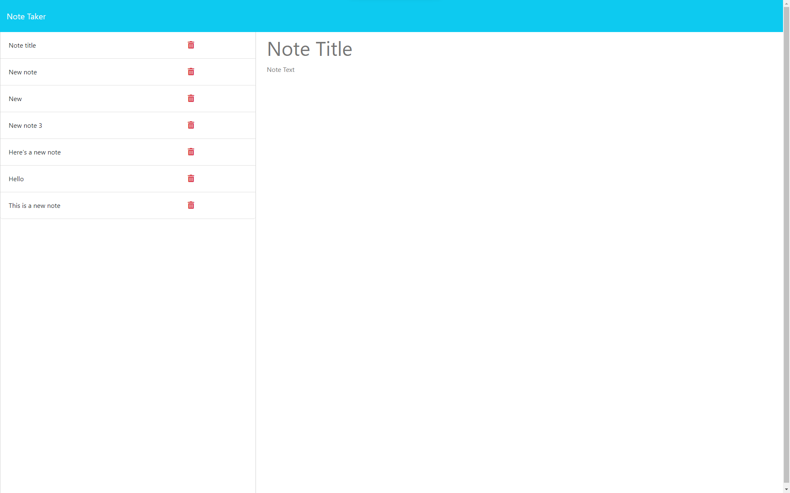

# Notes 'n Boats

## Description
Notes 'n Boats is a web-based note taking application. Notes 'n Boats allows users to easily create, store, and access their very own list own notes stored using a back-end application. This application is powered by using express.js.

The following is a screenshot of the final application:
 

## Usage
Here is the link to the [live webpage](https://gentle-sea-33802-1a93986a926d.herokuapp.com/).

## Credits
The following are resources, tutorials, and individuals who assisted in the development of this project:

* https://www.heroku.com
* https://www.npmjs.com/package/express
* https://youtu.be/SccSCuHhOw0?si=66whUOHpYnrW3mQ9
* Karina Guerrero Fernandez
* Tom Gold
* Jaytee Padilla

## Questions
[Github profile](https://github.com/HoneyBuzz94)

sjohngrow@gmail.com
